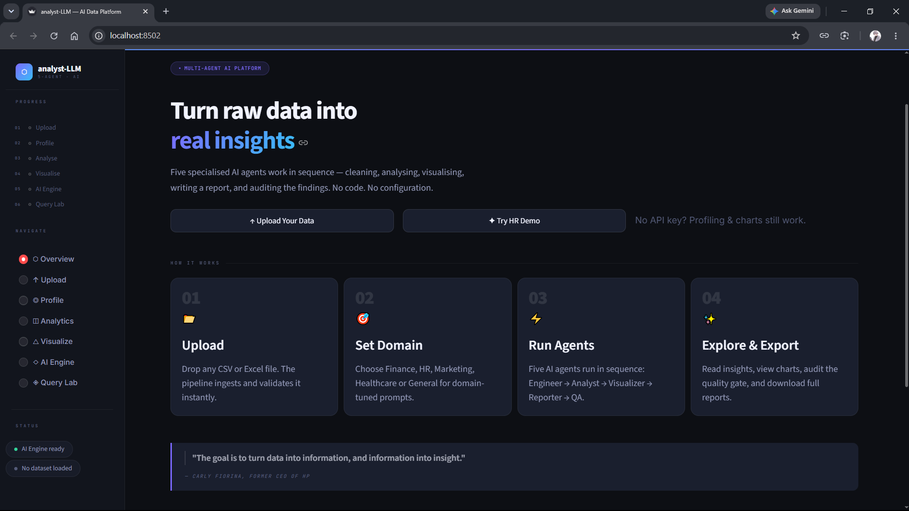

# 🤖 analyst-LLM — Multi-Agent AI Data Analyst

An AI-powered **Multi-Agent Data Analysis System** that automatically profiles datasets, performs analysis, generates visualizations, produces analytical reports, and validates findings using specialized AI agents.

The project combines **Python, Streamlit, Pandas, NumPy, Plotly, and Groq-powered Llama models** into an interactive data-analysis platform.

---

## 📌 Project Overview

Traditional data analysis involves several stages, including data profiling, exploratory analysis, visualization, interpretation, and report preparation.

**analyst-LLM** brings these stages together into a single workflow using specialized AI agents that collaborate through shared analytical context.

Users can upload **CSV or Excel datasets** and move through the analysis workflow:

```text
Upload Dataset
      ↓
Data Profiling
      ↓
Analyse
      ↓
Visualise
      ↓
AI Engine
      ↓
Query Lab
      ↓
Quality Gate
```

The system provides:

* 📊 Automated data profiling and exploration
* 🧠 AI-powered analytical insights
* 📈 Interactive visualizations
* 📋 AI-generated analytical reports
* 🛡️ Quality Gate validation
* 🔗 Agent-to-agent context sharing
* 🔎 Natural-language analytical assistance
* 🧮 SQL and DAX query assistance
* 📥 Report and result export options
* 🌐 Interactive Streamlit dashboard

---

## ✨ Features

### 📂 Dataset Analysis

* Upload CSV and Excel files
* Automatic dataset profiling
* Column and data-type inspection
* Missing-value analysis
* Duplicate detection
* Descriptive statistics
* Data-quality observations

### 🧠 Multi-Agent AI Analysis

The system uses five specialized AI agents:

1. **Data Engineer**
2. **Data Analyst**
3. **Data Visualization Specialist**
4. **Business Report Writer**
5. **Quality Gate Auditor**

Each agent has a dedicated role and receives relevant context from earlier stages of the pipeline.

### 📊 Interactive Visualizations

The application supports interactive data visualization using Plotly and provides visual analysis based on the characteristics of the uploaded dataset.

### 📋 AI-Generated Reports

The Report Writer combines the available dataset profile, analytical findings, and visualization information to produce a structured analytical report.

Reports can include:

* Executive summary
* Key findings
* Statistical observations
* Trends and patterns
* Business insights
* Visualization interpretation
* Recommendations

### 🛡️ Quality Gate

The Quality Gate acts as a final validation layer.

It reviews generated analytical content for issues such as:

* Unsupported claims
* Data inconsistencies
* Incorrect interpretations
* Potential analytical issues
* Claims requiring verification

### 🔎 Query Lab

Query Lab provides AI-assisted query development using the dataset schema as context.

It includes:

* **SQL Query Optimizer**
* **DAX Optimizer**
* **Automatic query generation from dataset context**

> Query Lab provides AI-assisted query generation and optimization. It does not imply that SQL or DAX queries are executed against an external database unless such execution is explicitly implemented.

---

## 🧠 Multi-Agent Architecture

The application follows a sequential five-agent architecture.

### 1️⃣ Data Engineer — Agent #1

Responsible for understanding and profiling the uploaded dataset.

**Responsibilities:**

* Dataset inspection
* Data-quality observations
* Data structure analysis
* Cleaning and engineering recommendations
* Preparation of analytical context

The resulting context is passed to the Data Analyst.

---

### 2️⃣ Data Analyst — Agent #2

Receives the Data Engineer's output and performs deeper analytical reasoning.

**Responsibilities:**

* Descriptive statistics
* Pattern identification
* Correlation analysis
* Trend analysis
* Segmentation
* Business-oriented insights

The analysis is passed to subsequent visualization and reporting stages.

---

### 3️⃣ Data Visualization Specialist — Agent #3

Uses the analytical results to determine appropriate visual representations.

**Responsibilities:**

* Chart recommendations
* Visualization generation
* Visualization code generation
* Selection of suitable visual formats

---

### 4️⃣ Business Report Writer — Agent #4

Combines information from the preceding stages to generate a structured analytical report.

The report may contain:

* Executive summary
* Key findings
* Statistical observations
* Trends and patterns
* Business insights
* Visualization interpretation
* Recommendations

---

### 5️⃣ Quality Gate Auditor — Agent #5

Acts as the final quality-control layer.

**Responsibilities:**

* Audit the generated report
* Identify unsupported claims
* Check analytical consistency
* Identify questionable interpretations
* Highlight claims requiring verification

---

## 🔄 Application Workflow

```text
                    ┌──────────────────────┐
                    │    Upload Dataset    │
                    │      CSV / Excel     │
                    └──────────┬───────────┘
                               ↓
                    ┌──────────────────────┐
                    │    Data Profiling    │
                    └──────────┬───────────┘
                               ↓
                    ┌──────────────────────┐
                    │   Data Engineer      │
                    │      Agent #1        │
                    └──────────┬───────────┘
                               ↓
                    ┌──────────────────────┐
                    │    Data Analyst      │
                    │      Agent #2        │
                    └──────────┬───────────┘
                               ↓
                    ┌──────────────────────┐
                    │   Visualization      │
                    │      Agent #3        │
                    └──────────┬───────────┘
                               ↓
                    ┌──────────────────────┐
                    │    Report Writer     │
                    │      Agent #4        │
                    └──────────┬───────────┘
                               ↓
                    ┌──────────────────────┐
                    │    Quality Gate      │
                    │      Agent #5        │
                    └──────────┬───────────┘
                               ↓
                    ┌──────────────────────┐
                    │     Final Results    │
                    └──────────────────────┘
```

---

## 🛠️ Technology Stack

| Category                   | Technology              |
| -------------------------- | ----------------------- |
| **Programming Language**   | Python                  |
| **LLM Provider**           | Groq API                |
| **LLM Model**              | Llama 3.3 70B Versatile |
| **Web Framework**          | Streamlit               |
| **Data Processing**        | Pandas, NumPy           |
| **Visualization**          | Plotly, Matplotlib      |
| **Environment Management** | python-dotenv           |
| **AI Architecture**        | Multi-Agent Pipeline    |

---

## 📸 Dashboard

### Main Dashboard



---

## ⚙️ Installation

### Prerequisites

* Python 3.10+
* pip
* A Groq API key

### 1. Clone the repository

```bash
git clone https://github.com/baalu-avr/analyst-LLM.git
cd analyst-LLM
```

### 2. Create a virtual environment

Windows PowerShell:

```powershell
python -m venv .venv
```

Activate it:

```powershell
.\.venv\Scripts\Activate.ps1
```

### 3. Install dependencies

```bash
pip install -r requirements.txt
```

### 4. Configure environment variables

Create a `.env` file in the project root:

```env
GROQ_API_KEY=your_groq_api_key
GROQ_MODEL=llama-3.3-70b-versatile
```

> Keep your `.env` file private. It is excluded from Git using `.gitignore`.

### 5. Run the application

```bash
streamlit run app.py
```

### 6. Open the application

The Streamlit server will normally provide a local address such as:

```text
http://localhost:8501
```

---

## 📁 Project Structure

```text
analyst-LLM/
│
├── app.py
├── requirements.txt
├── README.md
├── .gitignore
│
├── agents/
│   ├── crew_agents.py
│   └── prompts.py
│
├── utils/
│   └── visualizer.py
│
└── assets/
    └── analyst-llm-dashboard.png
```

---

## 🔐 Configuration

### Environment Variables

| Variable       | Description                        | Example                   |
| -------------- | ---------------------------------- | ------------------------- |
| `GROQ_API_KEY` | Groq API authentication key        | `gsk_xxxxxxxxxxxx`        |
| `GROQ_MODEL`   | Groq model used by the application | `llama-3.3-70b-versatile` |

The application loads these values from the local `.env` file.

---

## 🤖 AI Model

The current configuration uses:

```text
Model: llama-3.3-70b-versatile
Provider: Groq
```

The Groq API is used for the AI-powered stages of the application, including multi-agent analysis, report generation, Quality Gate auditing, and Query Lab assistance.

---

## 📤 Outputs

Depending on the workflow stage, the application can provide:

* Dataset profiles
* Analytical findings
* Interactive charts
* AI-generated reports
* Quality Gate feedback
* SQL suggestions
* DAX suggestions
* Exportable analysis results

---

## 🔒 Security

The project uses environment variables for API credentials.

**Never commit your `.env` file or expose your Groq API key publicly.**

The repository's `.gitignore` includes:

```text
.env
.venv/
__pycache__/
*.pyc
```

---

## 🎯 Project Goals

The main goals of **analyst-LLM** are to:

* Simplify exploratory data analysis
* Demonstrate practical multi-agent AI architecture
* Combine traditional data-analysis tools with LLM capabilities
* Automate repetitive analytical workflows
* Generate useful visual and textual insights
* Add a validation layer to AI-generated analytical reports
* Provide an interactive environment for dataset analysis

---

## 🚀 Future Improvements

Potential future enhancements include:

* Support for additional LLM providers
* More specialized analytical agents
* Advanced statistical analysis
* Database connectivity
* Automated machine-learning workflows
* More visualization options
* Persistent analytical memory
* Advanced report export formats
* Authentication and multi-user support

---

## 📄 License

This project is intended for educational, experimental, and portfolio purposes.

---

## 👨‍💻 Project

**analyst-LLM**

An interactive multi-agent AI platform for automated data analysis, visualization, reporting, and analytical quality validation.

---

**Last Updated:** 2026-08-18
